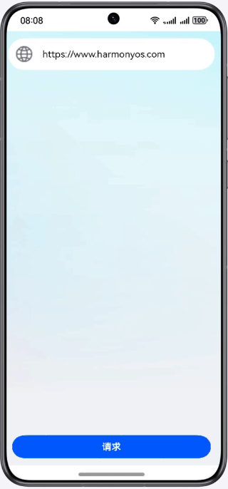

# HTTPS请求过程

### 简介

基于网络模块，实现数据安全加密传输。

### 相关概念

- Webview：提供Web控制能力，Web组件提供网页显示能力。
- HTTP数据请求：网络管理模块，提供HTTP数据请求能力，支持GET、POST、OPTIONS、HEAD、PUT、DELETE、TRACE、CONNECT请求方法。
- HTTPS：应用层协议，支持加密传输以及身份认证，保证数据的安全传输。
- SSL：SSL（Secure Socket Layer）安全套接层是位于传输通信协议（TCP/IP）之上实现的一种安全协议。
- TLS：TLS（Transport Layer Security）是一种安全协议，旨在实现数据加密传输。

### 相关权限

不涉及

### 使用说明

1. 如何使用@kit.NetworkKit进行https请求。

### 约束与限制

1. 本示例仅支持标准系统上运行，支持设备：华为手机。
2. HarmonyOS系统：HarmonyOS NEXT Developer Beta1及以上。
3. DevEco Studio版本：DevEco Studio NEXT Developer Beta1及以上。
4. HarmonyOS SDK版本：HarmonyOS NEXT Developer Beta1 SDK及以上。
