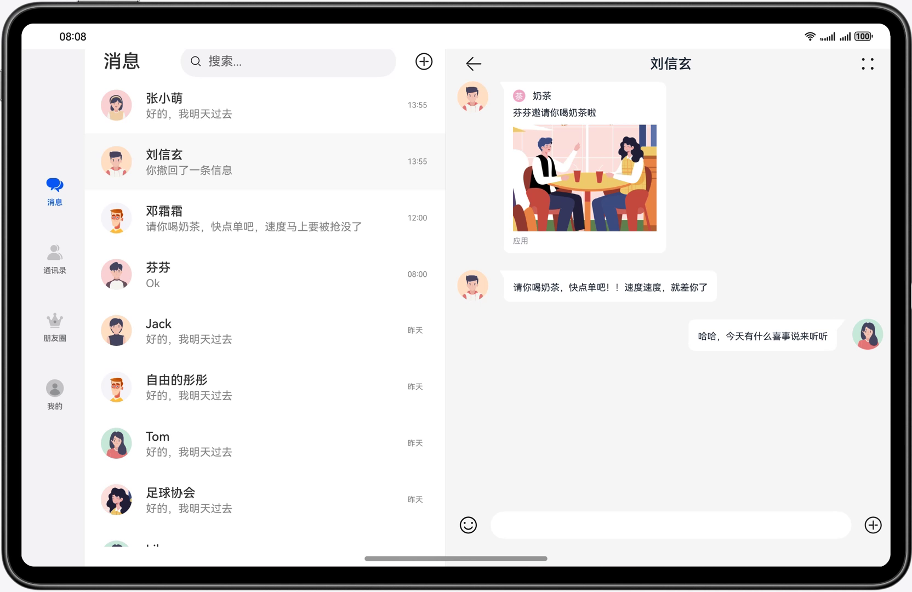

# 一多开发实例-即时通讯

### 简介

基于自适应和响应式布局，实现一次开发，多端部署-即时通讯。

#### 介绍

本篇Codelab基于自适应布局和响应式布局，实现一次开发，多端部署的即时通讯页面。通过“三层工程架构”实现代码复用，并根据手机、折叠屏以及2in1不同的设备尺寸设计对应页面。
手机效果如图所示：

折叠屏展开态效果如图所示：

2in1效果如图所示：

#### 相关概念

- 一次开发，多端部署：一套代码工程，一次开发上架，多端按需部署。支撑开发者快速高效的开发支持多种终端设备形态的应用，实现对不同设备兼容的同时，提供跨设备的流转、迁移和协同的分布式体验。
- 自适应布局：当外部容器大小发生变化时，元素可以根据相对关系自动变化以适应外部容器变化的布局能力。相对关系如占比、固定宽高比、显示优先级等。常见的自适应布局有：线性布局、层叠布局、弹性布局、相对布局等。自适应布局能力可以实现界面显示随外部容器大小连续变化。
- 响应式布局：当外部容器大小发生变化时，元素可以根据断点、栅格或特定的特征（如屏幕方向、窗口宽高等）自动变化以适应外部容器变化的布局能力。
- Navigation：页面根容器，一般用于分栏布局场景使用。

#### 相关权限

不涉及。

#### 使用说明

- 分别在手机、折叠屏、平板安装并打开应用，不同设备的应用页面通过响应式布局和自适应布局呈现不同的效果。
- 点击底部消息、通讯录、社交圈，将切换显示对应的标签页，默认显示消息标签页。

#### 约束与限制

1. 本示例仅支持标准系统上运行，支持设备：华为手机。
2. HarmonyOS系统：HarmonyOS NEXT Developer Beta1及以上。
3. DevEco Studio版本：DevEco Studio NEXT Developer Beta1及以上。
4. HarmonyOS SDK版本：HarmonyOS NEXT Developer Beta1 SDK及以上。
