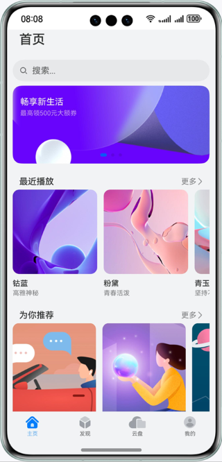
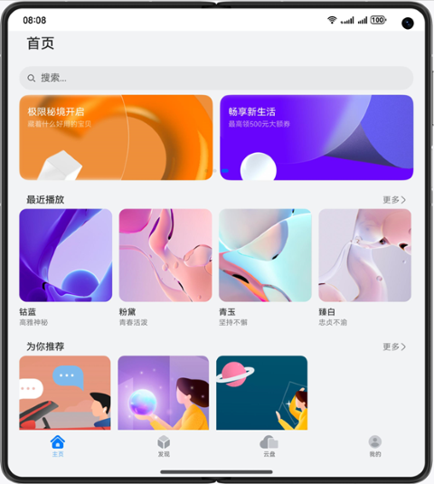
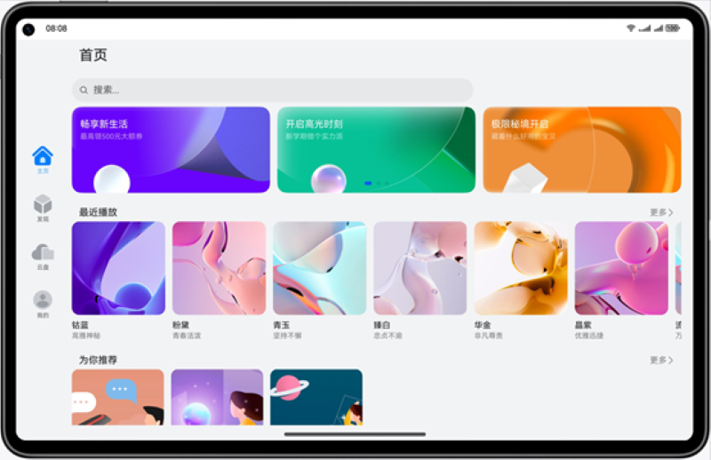

# 一次开发，多端部署-视频应用

### 简介

基于“一次开发，多端部署”能力实现的一个视频播放类应用主页面。

手机效果图如下：

折叠屏效果图如下：

平板效果图如下：

### 相关概念

- 一次开发，多端部署：指一套代码工程，一次开发上架，多端按需部署，目标是支撑开发者高效地开发支持多种终端设备形态的应用。
- 自适应布局：当外部容器大小发生变化时，元素可以根据相对关系自动变化以适应外部容器变化的布局能力。
- 响应式布局：当外部容器大小发生变化时，元素可以根据断点、栅格或特定的特征（如屏幕方向、窗口宽高等）自动变化以适应外部容器变化的布局能力。
- GridRow：栅格容器组件，仅可以和栅格子组件（GridCol）在栅格布局场景中使用。
- GridCol：栅格子组件，必须作为栅格容器组件（GridRow）的子组件使用。

### 相关权限

不涉及

### 使用说明

1. 在手机、折叠屏和平板上安装应用，打开会显示不同形态的用户界面。

### 约束与限制

1. 本示例仅支持标准系统上运行，支持设备：华为手机。
2. HarmonyOS系统：HarmonyOS NEXT Developer Beta1及以上。
3. DevEco Studio版本：DevEco Studio NEXT Developer Beta1及以上。
4. HarmonyOS SDK版本：HarmonyOS NEXT Developer Beta1 SDK及以上。
