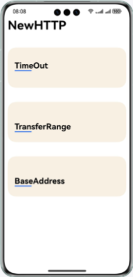
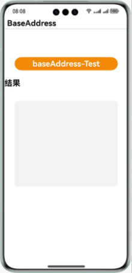
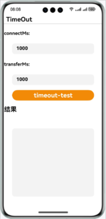
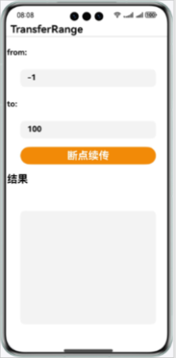

# 远场通信服务示例代码

## 简介

Remote Communication Kit（远场通信服务）是华为提供的HTTP发起数据请求的NAPI封装。应用通过Remote Communication Kit可便捷快速地向服务器发起数据请求。

## 开发前准备

- 在开发HarmonyOS应用前，先进行对应的开发环境安装与调试。
- 了解远场通信服务代码结构。

## 效果预览






## 工程目录

```
└── entry/src/main/ets
    ├── entryability
    │   └── FormAbility.ets        //表单
    │   └── MainAbility.ets        //UI Ability
    │   └── TestClickActionAbility.ets  //系统测试
    └── pages
        └── MainPage.ets      // 主界面
        └── baseAddress.ets      // 基础URL测试页面
        └── timeOut.ets      //  超时测试页面
        └── transferRange.ets      // 断点续传页面
```

## 具体实现

本示例主要展示的基础URL测试、超时测试、断点续传功能对应的接口均在@hms.collaboration.rcp.d.ts中：

- 断点续传(TransferRange)：TransferRange{from?: number; to?: number;}。
- 超时测试(timeOut)：TransferConfiguration{timeout?: Timeout;}。
- 基础URL(baseAddress)：SessionConfiguration{baseAddress?: URLOrString;}

以上业务使用时，需先import @kit.RemoteCommunicationKit，再根据自身需求对接口进行扩展使用，详细情况可以参考本用例中entry/src/main/pages下三个接口的实现。

## 相关权限

本Demo需要使用Internet和查询指定应用信息的权限，请在配置文件module.json5中添加以下权限：

1. 允许使用Internet网络权限：ohos.permission.INTERNET

2. 查询指定应用信息权限：ohos.permission.GET_BUNDLE_INFO(可选)

## 使用说明

如果在运行该示例代码时，出现运行不了的情况，可尝试选择DevEco Studio菜单栏Build里面的Clean Project选项，来清理工程。

## 约束与限制

1.本示例仅支持标准系统上运行，支持设备：华为手机。  
2.HarmonyOS系统：HarmonyOS NEXT Developer Beta1及以上。  
3.DevEco Studio版本：DevEco Studio NEXT Developer Beta1及以上。  
4.HarmonyOS SDK版本：HarmonyOS NEXT Developer Beta1 SDK及以上。