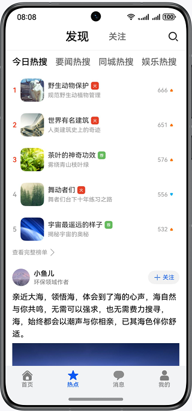
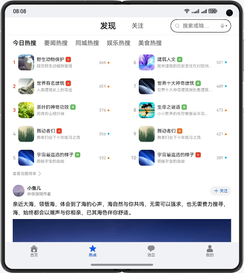
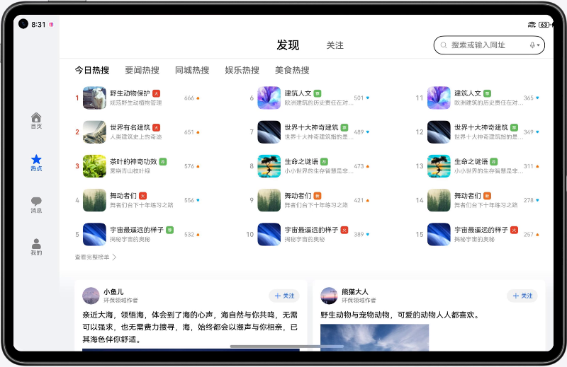

# 优秀实践-一次开发，多端部署-社区评论

### 简介

基于自适应布局和响应式布局，实现一次开发，多端部署的社区评论页。

手机运行效果图如下：

折叠屏运行效果图如下：

平板运行效果图如下：

### 相关概念

- 一次开发，多端部署：一套代码工程，一次开发上架，多端按需部署。支撑开发者快速高效的开发支持多种终端设备形态的应用，实现对不同设备兼容的同时，提供跨设备的流转、迁移和协同的分布式体验。
- 自适应布局：当外部容器大小发生变化时，元素可以根据相对关系自动变化以适应外部容器变化的布局能力。相对关系如占比、固定宽高比、显示优先级等。
- 响应式布局：当外部容器大小发生变化时，元素可以根据断点、栅格或特定的特征（如屏幕方向、窗口宽高等）自动变化以适应外部容器变化的布局能力。
- GridRow：栅格容器组件，仅可以和栅格子组件（GridCol）在栅格布局场景中使用。
- GridCol：栅格子组件，必须作为栅格容器组件（GridRow）的子组件使用。

### 相关权限

不涉及。

### 使用说明

1. 分别在手机、折叠屏、平板安装并打开应用，不同设备的应用页面通过响应式布局和自适应布局呈现不同的效果。
2. 点击底部首页、热点、消息、我的图片文字按钮，切换显示对应的标签页，默认显示热点标签页。
3. 点击热搜标题，切换热搜列表。
4. 点击查看完整榜单按钮，跳转至热搜榜单页。热搜榜单页支持上下及左右滑动，点击返回按钮退回至热点页。
5. 热点页点击图片进入图片详情页。手机设备只展示图片，折叠屏及平板展示正文及评论。点击图片或返回按钮退回至热点页。
6. 热点页点击卡片正文进入详情页。详情页正文文字区域支持双指缩放。折叠屏右上角按钮支持切换左右及上下布局。点击返回按钮退回至热点页。

### 约束与限制

1. 本示例仅支持标准系统上运行，支持设备：华为手机。
2. HarmonyOS系统：HarmonyOS NEXT Developer Beta1及以上。
3. DevEco Studio版本：DevEco Studio NEXT Developer Beta1及以上。
4. HarmonyOS SDK版本：HarmonyOS NEXT Developer Beta1 SDK及以上。
