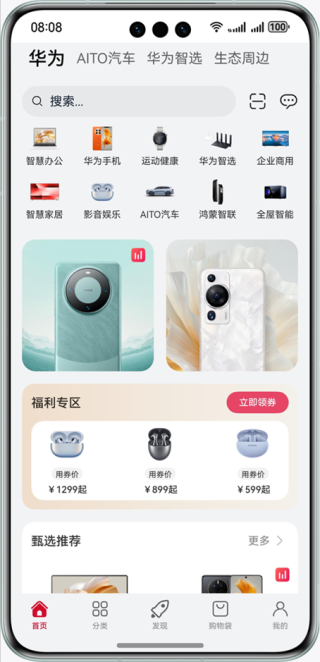
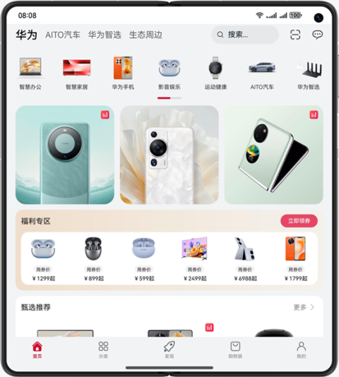
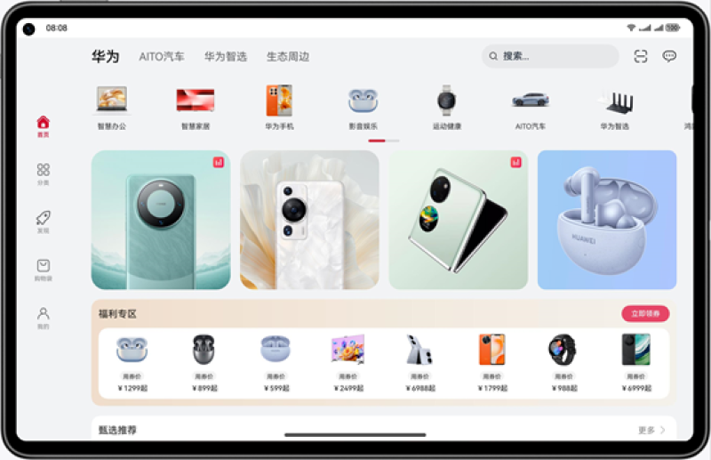

# 优秀实践-一多开发实例-购物比价

### 简介

本篇Codelab基于自适应布局和响应式布局，实现一次开发，多端部署的购物比价页面。通过“三层工程架构”实现代码复用，并根据手机、折叠屏、平板以及2in1不同的设备尺寸实现对应页面。

手机运行效果图如下：

折叠屏运行效果图如下：

平板、2in1运行效果图如下：

### 相关概念

- 一次开发，多端部署：一套代码工程，一次开发上架，多端按需部署。支撑开发者快速高效的开发支持多种终端设备形态的应用，实现对不同设备兼容的同时，提供跨设备的流转、迁移和协同的分布式体验。
- 自适应布局：当外部容器大小发生变化时，元素可以根据相对关系自动变化以适应外部容器变化的布局能力。相对关系如占比、固定宽高比、显示优先级等。
- 响应式布局：当外部容器大小发生变化时，元素可以根据断点、栅格或特定的特征（如屏幕方向、窗口宽高等）自动变化以适应外部容器变化的布局能力。
- GridRow：栅格容器组件，仅可以和栅格子组件（GridCol）在栅格布局场景中使用。
- GridCol：栅格子组件，必须作为栅格容器组件（GridRow）的子组件使用。
- 画中画：应用在视频播放、视频会议、视频通话等场景下，可以使用画中画能力将视频内容以小窗（画中画）模式呈现。

### 相关权限

不涉及。

### 使用说明

1. 分别在手机、折叠屏、平板安装并打开应用，不同设备的应用页面通过响应式布局和自适应布局呈现不同的效果。
2. 打开应用，查看首页内容。
3. 点击底部分类按钮，查看分类页内容。
4. 点击底部购物袋，查看购物袋页内容。
5. 点击分类页的商品图，查看商品详情页内容。
6. 点击右上角的分屏按钮，分屏比较商品信息。
7. 点击商品详情页底部的聊天按钮，查看商品详情咨询客服页内容。
8. 点击商品详情页底部的购物袋按钮，查看商品详情-购物袋页内容。
9. 点击商品详情页底部的购买按钮，查看商品详情-支付页内容。
10. 点击商品详情页的直播中按钮，查看直播间页内容，点击右上角关闭按钮以画中画模式观看直播。
11. 点击直播间页推荐商品，查看直播间-商品详情页内容。
12. 点击直播间页底部购物袋按钮，查看直播间-购物袋页内容。
13. 点击直播间-购物袋页的立即购买按钮，查看直播间-支付页内容。

### 约束与限制

1. 本示例仅支持标准系统上运行，支持设备：华为手机。
2. HarmonyOS系统：HarmonyOS NEXT Developer Beta1及以上。
3. DevEco Studio版本：DevEco Studio NEXT Developer Beta1及以上。
4. HarmonyOS SDK版本：HarmonyOS NEXT Developer Beta1 SDK及以上。
