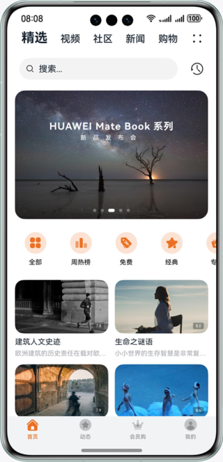
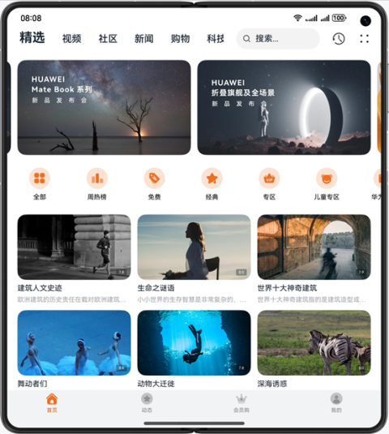
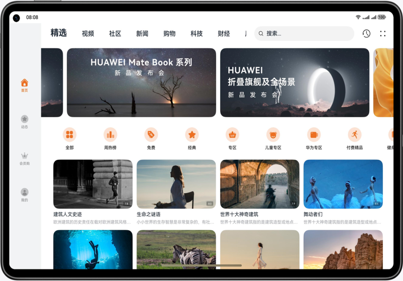

# 优秀实践-一多开发实例-长视频

### 简介

本篇Codelab基于自适应布局和响应式布局，实现一次开发，多端部署的长视频页面。通过“三层工程架构”实现代码复用，并根据手机、折叠屏、平板以及2in1不同的设备尺寸实现对应页面。

手机运行效果图如下：

折叠屏运行效果图如下：

平板、2in1运行效果图如下：

### 相关概念

- 一次开发，多端部署：一套代码工程，一次开发上架，多端按需部署。支撑开发者快速高效的开发支持多种终端设备形态的应用，实现对不同设备兼容的同时，提供跨设备的流转、迁移和协同的分布式体验。
- 自适应布局：当外部容器大小发生变化时，元素可以根据相对关系自动变化以适应外部容器变化的布局能力。相对关系如占比、固定宽高比、显示优先级等。
- 响应式布局：当外部容器大小发生变化时，元素可以根据断点、栅格或特定的特征（如屏幕方向、窗口宽高等）自动变化以适应外部容器变化的布局能力。
- GridRow：栅格容器组件，仅可以和栅格子组件（GridCol）在栅格布局场景中使用。
- GridCol：栅格子组件，必须作为栅格容器组件（GridRow）的子组件使用。
- 使用AVPlayer开发音频播放：使用AVPlayer可以实现端到端播放原始媒体资源。

### 相关权限

不涉及。

### 使用说明

1. 分别在手机、折叠屏、平板安装并打开应用，不同设备的应用页面通过响应式布局和自适应布局呈现不同的效果。
2. 首页内容，支持上下滑动，Banner左右滑动，图标列表左右滑动。
3. 长按推荐视频区域的第一张图片，能够预览视频。鼠标右键点击推荐视频区域，弹出菜单。鼠标悬停在推荐视频区域，图片放大。 2in1和折叠屏设备，两指捏合推荐视频区能够缩放或放大。
4. 切换顶部的社区tab，查看首页的沉浸式设计。2in1设备，切换顶部的视频tab，查看Banner图的创新排版。
5. 点击顶部的搜索框，展示搜索页内容。 搜索框输入“华”，出现智能提示页面。点击智能提示中的“华为发布会”，出现搜索结果页面。点击搜索结果中的播放按钮，进入视频详情页。
6. 视频详情页默认播放视频，点击视频进行播放/暂停，点击/拖动进度条能够跳转播放。
7. 手机/折叠屏上滑时，相关列表先隐藏，视频再等比缩小，然后滑动评论区；2in1上滑时，视频等比缩小，然后滑动简介区。点击视频区域的全屏按钮，进入全屏播放页。
8. 全屏播放视频，点击播放/暂停按钮，控制视频播放/暂停。点击选集按钮，显示选集工具栏。

### 约束与限制

1. 本示例仅支持标准系统上运行，支持设备：华为手机。
2. HarmonyOS系统：HarmonyOS NEXT Developer Beta1及以上。
3. DevEco Studio版本：DevEco Studio NEXT Developer Beta1及以上。
4. HarmonyOS SDK版本：HarmonyOS NEXT Developer Beta1 SDK及以上。
