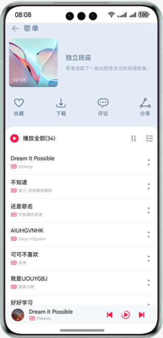
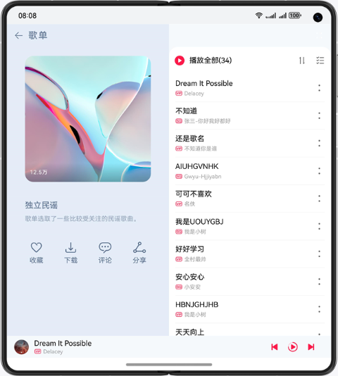
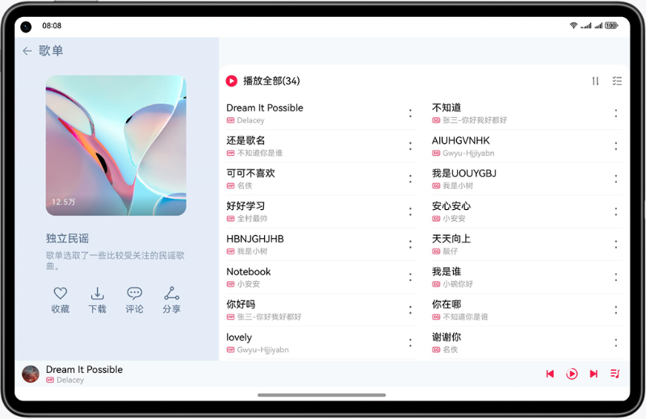

# 优秀实践-一次开发，多端部署-音乐专辑

### 简介

基于自适应和响应式布局，实现一次开发、多端部署音乐专辑。

手机效果图如下：

折叠屏效果图如下：

平板效果图如下：

### 相关权限

不涉及

### 使用说明

1. 分别在手机、折叠屏、平板安装并打开应用，不同设备的应用页面通过响应式布局和自适应布局呈现不同的效果。
2. 点击界面上播放/暂停、上一首、下一首图标控制音乐播放功能。
3. 点击界面上播放控制区空白处或列表歌曲跳转到播放页面。
4. 点击界面上评论按钮跳转到对应的评论页面。
5. 其他按钮无实际点击事件或功能。

### 约束与限制

1. 本示例仅支持标准系统上运行，支持设备：华为手机。
2. HarmonyOS系统：HarmonyOS NEXT Developer Beta1及以上。
3. DevEco Studio版本：DevEco Studio NEXT Developer Beta1及以上。
4. HarmonyOS SDK版本：HarmonyOS NEXT Developer Beta1 SDK及以上。