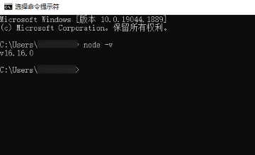
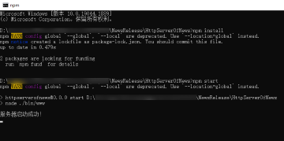

# 网络-新闻发布

### 简介

基于网络管理和文件管理实现新闻发布和新闻加载刷新的功能。

### 相关概念

- 数据请求：本模块提供HTTP数据请求能力。应用可以通过HTTP发起一个数据请求，支持常见的GET、POST、OPTIONS、HEAD、PUT、DELETE、TRACE、CONNECT方法。
- 上传下载：request部件主要给应用提供上传下载文件、后台传输代理的基础能力。
- 选择器：选择器(Picker)是一个封装PhotoViewPicker、DocumentViewPicker、AudioViewPicker等系统应用选择与保存能力的模块。
- 文件管理：该模块为基础文件操作API，提供基础文件操作能力，包括文件基本管理、文件目录管理、文件信息统计、文件流式读写等常用功能。

### 相关权限

网络使用权限：ohos.permission.INTERNET

### 使用说明

#### 服务端搭建流程

1. 搭建nodejs环境：本篇Codelab的服务端是基于nodejs实现的，需要安装nodejs，如果您本地已有nodejs环境可以跳过此步骤。
   1. 检查本地是否安装nodejs：打开命令行工具（如Windows系统的cmd和Mac电脑的Terminal，这里以Windows为例），输入node -v，如果可以看到版本信息，说明已经安装nodejs。

   
   2. 如果本地没有nodejs环境，您可以去nodejs官网上下载所需版本进行安装配置。
   3. 配置完环境变量后，重新打开命令行工具，输入node -v，如果可以看到版本信息，说明已安装成功。
2. 运行服务端代码：在本项目的HttpServerOfNews目录下打开命令行工具，输入npm install 安装服务端依赖包，安装成功后输入npm start点击回车。看到“服务器启动成功！"则表示服务端已经在正常运行。

3. 构建局域网环境：测试本Codelab时要确保运行服务端代码的电脑和测试机连接的是同一局域网下的网络，您可以用您的手机开一个个人热点，然后将测试机和运行服务端代码的电脑都连接您的手机热点进行测试。
4. 连接服务器地址：打开命令行工具，输入ipconfig命令查看本地ip，将本地ip地址复制到src/main/ets/common/constants/Constants.ets文件下的18行，注意只替换ip地址部分，不要修改端口号，保存好ip之后即可运行Codelab进行测试。

#### 前端使用说明

1. 在应用首页，用户可以通过点击顶部的新闻分类来切换页面展示的新闻列表数据。
2. 当新闻列表滑动到顶部时，用户可以通过继续向下拖动页面来触发下拉刷新的功能。
3. 当新闻列表滑动到底部时，用户可以通过继续向上拖动页面来触发上拉加载更多数据的功能。
4. 在应用首页，用户可以通过点击右下角的加号按钮跳转到新闻发布页面。
5. 在新闻发布页面，用户点击加号可以进行选择图片。
6. 在新闻发布页面，用户点击底部的“发布”按钮来进行上传图片和发布新闻数据。

### 约束与限制

1. 本示例仅支持标准系统上运行，支持设备：华为手机。
2. HarmonyOS系统：HarmonyOS NEXT Developer Beta1及以上。
3. DevEco Studio版本：DevEco Studio NEXT Developer Beta1及以上。
4. HarmonyOS SDK版本：HarmonyOS NEXT Developer Beta1 SDK及以上。
